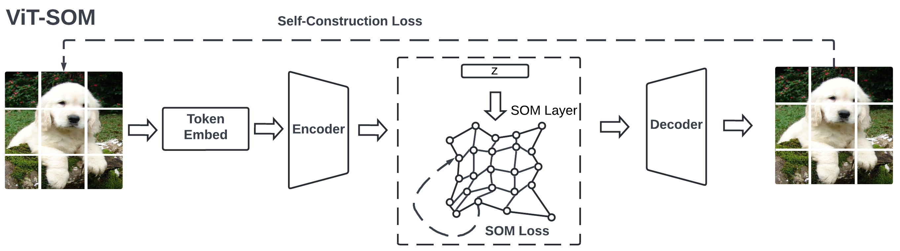
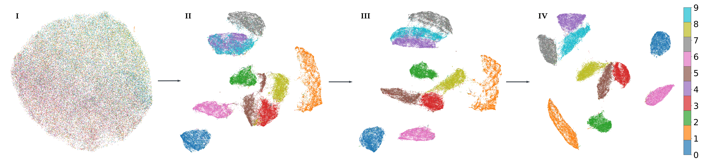
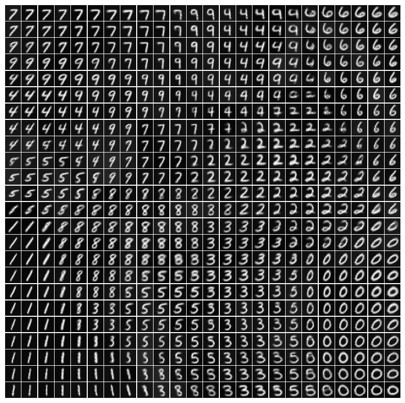

# ViT-SOM

This is the official implementation of the paper: [A. Luo, K. Yuan, "Simple Self-Organizing Map with Visual Transformer," in IEEE Signal Processing Letters, DOI: 10.1109/LSP.2025.3643388.](https://ieeexplore.ieee.org/document/11298561)


*Figure 1: Overview of the ViT-SOM architecture demonstrating the self-construction loss mechanism.*

## Environment

* **Python** → `3.8.5`
* **Pytorch** → `'2.2.1+cu121'`
* **Pytorch Lightning** → `2.2.1`

## How to run

1.  **Build container**
    ```bash
    make build
    ```
2.  **Execute container and run experiment**
    ```bash
    make run accelerator=cuda devices=1
    ```
3.  **Run corresponding experiments**
    ```bash
    make train model=vit_som dataset=cifar-10
    ```
4.  **Launch Tensorboard**
    ```bash
    tensorboard --logdir=logs --bind_all
    ```

## Repo Structure

* `/configs` → yaml configuration files detailing hyperparams, data configs, etc
* `/data` → builds dataloaders and applies augmentation
* `/models` → holds model files (`desom.py`, `vit_som.py`, etc.)
* `/tools` → contains utility scripts for evaluation metric gathering and other tools

---

## Experimental Results

### Qualitative Analysis
**Latent Space Evolution**
The visualization below shows the progression of the latent space separation from Epoch 0 to Epoch 199.
<p align="left">
  
</p>

**Prototype Decoding**
visualization of decoded prototypes organized in a 24x24 map, showcasing the topological preservation capabilities of ViT-SOM.
<p align="left">
  
</p>

### Quantitative Analysis

#### 1. Classification Performance
*Comparison of SOM-Enhanced ViT against standard baselines across multiple datasets.*

| Model | CIFAR-10 | CIFAR-100 | Flowers17 | SVHN | Tiny-ImageNet | MedMNIST | # Params |
| :--- | :---: | :---: | :---: | :---: | :---: | :---: | :---: |
| ResNet34 | 0.857±0.005 | 0.638±0.004 | 0.783±0.011 | 0.894±0.004 | 0.468±0.011 | 0.826±0.008 | 21.8M |
| Swin-T | 0.863±0.003 | 0.597±0.003 | 0.886±0.010 | 0.952±0.001 | 0.501±0.014 | 0.842±0.005 | 27.5M |
| DeiT-T | 0.857±0.009 | 0.608±0.003 | 0.882±0.013 | 0.958±0.007 | 0.499±0.009 | 0.838±0.007 | 28.9M |
| MobileViT-T | 0.863±0.010 | 0.681±0.007 | 0.739±0.071 | 0.946±0.003 | 0.452±0.018 | 0.840±0.006 | 4.9M |
| ViT-cls (reproduce) | 0.901±0.001 | 0.604±0.009 | 0.884±0.006 | 0.957±0.006 | 0.496±0.005 | 0.835±0.006 | 5.4M |
| **ViT-SOM-cls** | **0.920±0.003** | **0.683±0.006** | **0.917±0.002** | **0.966±0.001** | **0.502±0.008** | **0.844±0.004** | **5.4M** |

#### 2. Clustering Performance
*Benchmarking against deep clustering baselines.*

| Model | MNIST | Fashion-MNIST | USPS | # Params |
| :--- | :---: | :---: | :---: | :---: |
| SOM (24×24) | 0.711±0.005 | 0.668±0.002 | 0.732±0.009 | 451K |
| SOM-VAE | 0.868±0.03 | 0.739±0.002 | 0.854±0.010 | 3.7M |
| DESOM | 0.934±0.004 | 0.751±0.009 | 0.857±0.011 | 3.3M |
| ViT-SOM (24×24) | 0.936±0.003 | 0.817±0.002 | 0.935±0.006 | 2.5M |
| **ViT-SOM (40×40)** | **0.955±0.001** | **0.841±0.006** | **0.948±0.025** | **5.0M** |

#### 3. Computational Efficiency
*Training & Inference Times.*

| Task | Model | Training Time (s) | Inference Time (s) |
| :--- | :--- | :---: | :---: |
| **Clustering** | ViT-SOM (24x24) | 2432.052±10.940 | 1.60±0.003 |
| | ViT-SOM (40x40) | 2432.05±10.94 | 1.61±0.003 |
| | DESOM | 188.590±12.728 | 0.697±0.081 |
| | SOM-VAE | 463.213±26.911 | 1.094±0.005 |
| **Classification** | ViT-SOM (4x4) | 2923.095±26.832 | 8.471±1.120 |
| | ViT (baseline) | 2816.594±21.663 | 0.620±0.014 |
| | Swin | 2935.202±87.603 | 0.891±0.005 |
| | DeiT | 4135.050±51.043 | 0.912±0.039 |
| | MobileViT | 3162.329±68.293 | 0.791±0.063 |

*Peak GPU Memory Usage During Training.*

| Task | Model | Memory Usage (GB) |
| :--- | :--- | :---: |
| **Classification** | ViT-SOM (40×40) | 1.559 |
| | ViT | 1.435 |
| | Swin | 1.563 |
| | DeiT | 1.793 |
| | MobileViT | 1.449 |
| **Clustering** | ViT-SOM (24x24) | 0.394 |
| | ViT-SOM (40x40) | 0.664 |
| | SOM-VAE | 0.214 |
| | DESOM | 0.084 |

---

## Citation

```
@ARTICLE{11298561,
  author={Luo, Alan and Yuan, Kaiwen},
  journal={IEEE Signal Processing Letters}, 
  title={Simple Self-Organizing Map with Visual Transformer}, 
  year={2025},
  volume={},
  number={},
  pages={1-5},
  keywords={Self-organizing feature maps;Training;Transformers;Prototypes;Computer architecture;Measurement;Flowering plants;Computer vision;Vectors;Topology;Unsupervised learning;Self-organizing Map;Visual Transformer},
  doi={10.1109/LSP.2025.3643388}}
```